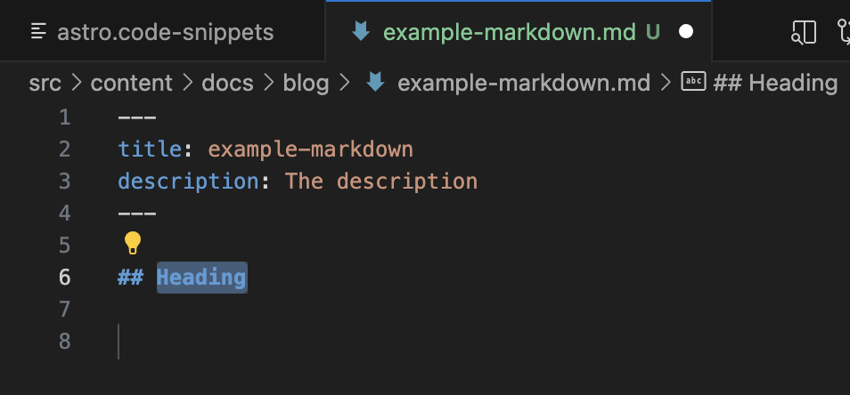

Cet article explique comment créer des extraits de code dans Visual Studio Code qui peuvent considérablement augmenter votre productivité lorsque vous travaillez régulièrement avec [les collections de contenu d'Astro](https://docs.astro.build/en/guides/content-collections).

:::note
Cet article est issu d'une suggestion de [Sarah Rainsberger](https://github.com/sarah11918) et met en lumière une fonctionnalité contribuée par [HiDeoo](https://github.com/HiDeoo) - tous les exemples de code sont également de HiDeoo.
:::

## Le besoin d'extraits

Astro prend en charge [la validation des schémas](https://docs.astro.build/en/guides/content-collections/#defining-the-collection-schema) pour vos champs de métadonnées dans les fichiers Markdown et MDX. Ainsi, de nombreux fichiers de contenu de vos collections auront la même structure entre les limites de code (`---`). Si vous en avez assez de taper les mêmes champs de métadonnées encore et encore, vous pouvez créer un extrait de code qui générera automatiquement la structure de base des métadonnées souhaitées tout en vous permettant de modifier facilement les champs avec des entrées `TAB ⇥`.

## Créer un extrait

Vous pouvez créer des extraits globaux qui peuvent être utilisés dans plusieurs langages ou des extraits spécifiques à un langage. Puisque nous souhaitons utiliser l'extrait de métadonnées aussi bien dans les fichiers Markdown *que* MDX, nous créerons un extrait global dans `Code/User/snippets/markdown.code-snippets` avec le scope `markdown,mdx`. Suivez les instructions dans la [documentation officielle](https://code.visualstudio.com/docs/editor/userdefinedsnippets#_create-your-own-snippets) pour connaître les étapes correctes selon votre système d'exploitation.

Voici un exemple de ce à quoi votre extrait pourrait ressembler. Vous pouvez ajuster librement le `body` ou `prefix` selon vos besoins :

```json title="Code/User/snippets/markdown.code-snippets"
{
  "Add Markdown frontmatter": {
    "scope": "markdown,mdx",
    "prefix": "ffmt",
    "body": [
      "---",
      "title: $TM_FILENAME_BASE",
      "description: The description",
      "---",
      "",
      "## ${1:Heading}",
      "",
      "$0"
    ],
  }
}
```

La flexibilité des extraits permet de créer des outils puissants et sur mesure pour booster votre productivité. Vous pouvez améliorer la configuration de base ci-dessus avec les champs de métadonnées spécifiques dont vous avez besoin, modifier la façon dont le titre est généré, et bien plus.

## Utiliser l'extrait

Créez un fichier Markdown (`.md`) ou `.mdx` vide. Commencez à taper `ffmt` et appuyez sur `TAB ⇥` pour déclencher l'extrait. Si vous ne voyez aucune suggestion, vous pouvez les déclencher manuellement avec `Ctrl + Espace` et sélectionner l'extrait `"Add Markdown frontmatter"`. Selon votre configuration exacte, vous pouvez maintenant naviguer entre les champs pour les modifier selon votre cas d'utilisation actuel. Par exemple, l'extrait ci-dessus vous permet de modifier directement le titre, puis de passer au contenu. Le champ titre des métadonnées sera défini comme le nom du fichier sans son extension.



## Ressources supplémentaires

Si vous trouvez les extraits utiles et souhaitez explorer une extension VS Code qui inclut un ensemble décent d'extraits préconfigurés, consultez [Astro Snippets de Shelton Louis](https://marketplace.visualstudio.com/items?itemName=SheltonLouis.astro-snippets).

Découvrez plus de conseils et astuces pour travailler avec Astro et Starlight sur [le blog de HiDeoo](https://hideoo.dev/notes).
