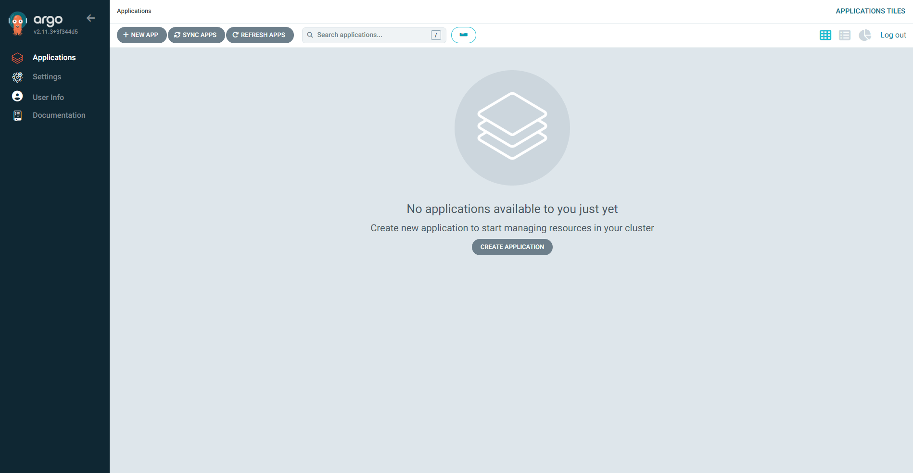

Having read Vegard S. Hagen's article “[Argo CD Kustomize with Helm](https://blog.stonegarden.dev/articles/2023/09/argocd-kustomize-with-helm/)” and decided that their solution was not the way to go for our cluster, we jumped straight into the default Argo CD “[Getting started](https://argo-cd.readthedocs.io/en/stable/getting_started/)” guide. And now we will walk you through the pain of setting up Argo CD on k3s and cilium, continuing from the chapter “[Setup Certificate Manager with Cloudflare](./setup-kubernetes-with-cilium-and-cloudflare#setup-certificate-manager-with-cloudflare)” of our most recent post “[Setting up Kubernetes with Cilium and Cloudflare](./setup-kubernetes-with-cilium-and-cloudflare)”. In this exact recent post we also set up [Keel](https://keel.sh/) at the end, but this step will now be unnecessary because we'll use Argo CD for getting the newest state-of-the-art code from each GitHub repo. Enjoy reading!

:::note
We assume that you followed our other blog post.
:::

## Requirements

Before we can start, we need to make sure we have `kubectl` installed, a kubeconfig file (k3s saves this file here:

```yaml
#/etc/rancher/k3s/config.yaml
flannel-backend: "none"
disable-kube-proxy: true
disable-network-policy: true
cluster-init: true
disable:
    - servicelb
    - traefik
```

) and CoreDNS (check if you have CoreDNS by running this

```bash
kubectl get pods -n kube-system -l k8s-app=kube-dns
```

command).

## Installation

First, let's apply all the necessary services, deployments and many other different kubernetes resources by running:

```bash
kubectl create namespace argocd
kubectl apply -n argocd -f https://raw.githubusercontent.com/argoproj/argo-cd/stable/manifests/install.yaml
```

## Certificate

Additionally, we'll need a certificate:

```yaml
apiVersion: cert-manager.io/v1
kind: Certificate
metadata:
    name: argocd
    namespace: argocd
spec:
    secretName: argocd
    issuerRef:
        name: acme-issuer
        kind: ClusterIssuer
    dnsNames:
        - "argo-cd.trueberryless.org"
```

Apply this resource by running `kubectl apply -f certificate.yaml`.

## Ingress Controller

And we'll need a ingress controller which is managed by Cilium:

```yaml
apiVersion: networking.k8s.io/v1
kind: Ingress
metadata:
    name: argocd-ingress
    namespace: argocd
spec:
    rules:
        - host: argo-cd.trueberryless.org
          http:
              paths:
                  - path: /
                    pathType: Prefix
                    backend:
                        service:
                            name: argocd-server
                            port:
                                number: 80

    tls:
        - hosts:
              - argo-cd.trueberryless.org
          secretName: argocd
```

Apply this resource by running `kubectl apply -f argocd-ingress.yaml`.

## Deactivate TSL within Argo CD

With the certificate the connection between the client and server is secured. However, there is still a self-signed certificate within the Argo CD services, which we don't necessarily need. We can therefore deactivate the security of the Argo CD server, by editing the property `server.insecure`.

In order to do that, we first run this command:

```bash
kubectl edit cm argocd-cmd-params-cm -n argocd
```

which will hopefully open a file in vim or neovim (otherwise would be cringe if you ask us, LMAO). The file should like something like this:

```yaml {21-22}
# Please edit the object below. Lines beginning with a '#' will be ignored,
# and an empty file will abort the edit. If an error occurs while saving this file will be
# reopened with the relevant failures.
#
apiVersion: v1
data:
    server.insecure: "true"
kind: ConfigMap
metadata:
    annotations:
        kubectl.kubernetes.io/last-applied-configuration: |
            {"apiVersion":"v1","kind":"ConfigMap","metadata":{"annotations":{},"labels":{"app.kubernetes.io/name":"argocd-cmd-params-cm","app.kubernetes.io/part-of":"argocd"},"name":"arg
    creationTimestamp: "2024-07-27T11:15:28Z"
    labels:
        app.kubernetes.io/name: argocd-cmd-params-cm
        app.kubernetes.io/part-of: argocd
    name: argocd-cmd-params-cm
    namespace: argocd
    resourceVersion: "239710156"
    uid: 5f53d26b-3adf-4ed9-9807-c3da847335a2
data:
    server.insecure: "true"
```

The last two lines will probably be not there at first, but this is exactly the setting we want to achieve. Go ahead and add those two lines (marked above) and save the file (`Esc` → `:wq` if you're cool).

Restart the Argo CD Server by running and waiting till the rollout is completed:

```bash
kubectl rollout restart deploy argocd-server -n argocd
kubectl rollout status deploy argocd-server -n argocd
```

After all those steps, we should now see the UI under [`https://argo-cd.trueberryless.org`](https://argo-cd.trueberryless.org) (password protected).



## Celebrate with a Coffee!

Congratulations, you've successfully set up Argo CD with k3s and Cilium! You deserve a coffee break. Enjoy a well-earned cup, and if you'd like to share a virtual coffee with me, feel free to support my work on [Ko-fi](https://ko-fi.com/trueberryless). Thank you!

## Continuation

Be continued for our [next blog](./setup-continuous-integration-github-repository) which will describe how to set up a GitHub repository which can then be deployed via Argo CD.
