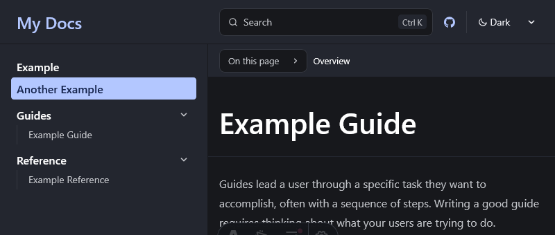
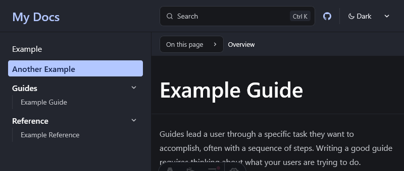
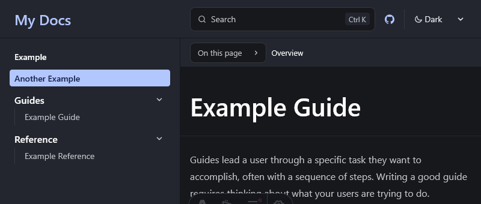

Have you ever wondered why your [Starlight][starlight] sidebar doesn't look that appealing? Did you know how important the space between items in your sidebar unconsciously is? The font size, the weight and little color differences? In this guide, we'll take a look at how you can customize the appearance of your Starlight sidebar with some quick and easy steps.

## Prerequisites

First, you need to [set up your Starlight site][starlight-getting-started]. Afterward, Starlight offers a [guide on customizing styles applied to your Starlight site][starlight-css], which is the feature we'll use in today's post.

As described in [this guide][starlight-css-custom], you need to create a `.css` file somewhere inside your `src/` directory, where you can define your CSS styles. Don't forget to add the path to this `.css` file to Starlight’s `customCss` array in `astro.config.mjs`:

```diff lang="js"
// astro.config.mjs
import { defineConfig } from 'astro/config';
import starlight from '@astrojs/starlight';

export default defineConfig({
  integrations: [
    starlight({
      title: 'Docs With Custom CSS',
      customCss: [
+        // Relative path to your custom CSS file
+        './src/styles/custom.css',
      ],
    }),
  ],
});
```

After completing these preparation steps, you are ready to try out some nice adjustments to Starlight's sidebar design.

## Customizations

There are endless different possibilities that you can play around with just with your custom CSS. I will give you some ideas that I found very helpful while playing around with the sidebar design myself. While some of these ideas might look silly to you, I promise that the combination of a few of them will make your Starlight sidebar look even better.

:::note
One thing to note though is that in this blog post the focus lies on adjusting the styling of **root-level items** (the ones without children) in the sidebar.
:::

But before I do that, I'll show you how the default styling of the Starlight sidebar currently looks like:


### Manipulate the whitespaces between sidebar items

On the root level of your Starlight sidebar, there are two different types of elements: **pages** and **groups**. While the default styling is pretty decent, I found the whitespaces - this is the margin between items which itself doesn't include any content - to be a bit too large, especially between root-level items. With this example of custom CSS down below, I made the margin between root-level items smaller while keeping the margin between groups the same. The important CSS styling is highlighted in the code block.

```css {3}
// src/styles/custom.css
sl-sidebar-state-persist ul.top-level > li:not(:has(details)) {
  margin-top: 0rem;
}
sl-sidebar-state-persist ul.top-level > li:has(details) {
  margin-block: 0.5rem; /* default value */
}
```



Perhaps, this will not be as useful to you because you don't use root-level pages in your sidebar, so this effect won't be noticeable to you. But if you do, give this a try.

### Adjust the font weight of sidebar items

[Imho][imho] the one thing that triggers me the most about Starlight's root-level items in the sidebar, is their boldness. This is probably a very opinionated take, but if you ask me, one single page can't possibly be as important as an entire group of pages in your documentation. Therefore, I made the font weight of root-level items thinner as you can see in the code block below.

```css {6}
// src/styles/custom.css
sl-sidebar-state-persist ul.top-level > li > a[aria-current="page"] {
  font-weight: 600; /* default value */
}
sl-sidebar-state-persist ul.top-level > li > a:not([aria-current="page"]) {
  font-weight: 400;
}
```



### Adjust the color of sidebar items

A small but subtle change: I made unselected root-level items appear dimmer in the code block below.

If you choose to use this design as well, I recommend that you only apply the second CSS manipulation since the first one is just for demonstrating how you could adjust the styling of selected root-level items – this rule also applies to the other code blocks in this blog if they are marked as `default value`.
```css {6}
// src/styles/custom.css
sl-sidebar-state-persist ul.top-level > li > a[aria-current="page"] {
  color: var(--sl-color-text-invert); /* default value */
}
sl-sidebar-state-persist ul.top-level > li > a:not([aria-current="page"]) {
  color: var(--sl-color-gray-2);
}
```


### Adjust the font size of sidebar items

Although I don't recommend it, you can also adjust the font size of sidebar items. With this example of custom CSS down below, I made the font size of root-level items smaller.

```css {3}
// src/styles/custom.css
sl-sidebar-state-persist ul.top-level > li > a {
  font-size: var(--sl-text-sm);
}
```



## Recommendations

Summing everything up, I recommend that you apply some mix of the above customization options, which you can conveniently see in a single `.css` file.

Note that I also use [Cascade Layers][starlight-css-cascade-layers], supported since [Starlight 0.34.0][starlight-0-34], and recommend using them to specify the order in which CSS styles are applied.

```css
// src/styles/custom.css
@layer starlight, my-starlight-sidebar;

@layer my-starlight-sidebar {
  sl-sidebar-state-persist ul.top-level > li:not(:has(details)) {
    margin-block: 0rem;
  }
  sl-sidebar-state-persist ul.top-level > li > a:not([aria-current="page"]) {
    font-weight: 400;
    color: var(--sl-color-gray-2);
  }
}
```

[starlight]: https://starlight.astro.build
[starlight-getting-started]: https://starlight.astro.build/getting-started/
[starlight-css]: https://starlight.astro.build/guides/css-and-tailwind/
[starlight-css-custom]: https://starlight.astro.build/guides/css-and-tailwind/#custom-css-styles
[starlight-css-cascade-layers]: https://starlight.astro.build/guides/css-and-tailwind/#cascade-layers
[starlight-0-34]: https://github.com/withastro/starlight/releases/tag/%40astrojs%2Fstarlight%400.34.0
[imho]: https://en.wiktionary.org/wiki/IMHO
