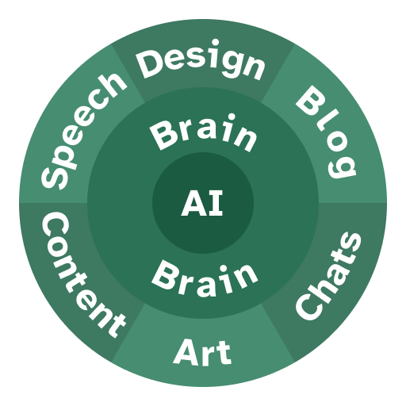

Es sind mehr als zweieinhalb Jahre vergangen seit der Veröffentlichung von ChatGPT. Der 30. November 2022 markierte den Beginn einer neuen Ära: den Anfang der KI. Heute nutzen viele Berufe und Privatpersonen, insbesondere im IT-Sektor, sie täglich. Und wir wissen nicht einmal, wo wir uns im Gartner-Hype-Zyklus befinden oder ob sich KI gemäß Kurzweils "Gesetz der beschleunigten Rückkehr" verbessern wird.

Der Trend ist weiterhin steigend, aber gleichzeitig habe ich eine leichte, jedoch stetige Verschlechterung von Wissen auf menschlicher Basis bemerkt, da immer mehr kreative Arbeit an KI delegiert wird. Daher habe ich mich entschlossen, einen kleinen Blogbeitrag zu schreiben, in dem ich meine Gedanken teile, um von einem übermäßigen Einsatz Künstlicher Intelligenz abzuraten, da dieser unsere kognitiven Fähigkeiten zerstören könnte. Und obwohl ich weiß, dass nur sehr wenige Menschen dies lesen werden, hält mich das nicht davon ab, es zu versuchen. Andernfalls könnte ich meine Chance verpassen, der Zukunft der Menschheit zu helfen.

{/* excerpt */}

> **Hinweis**: Dieser gesamte Blogpost basiert auf meinen Beobachtungen hinsichtlich gesellschaftlicher Entwicklungen mit einem besonderen Fokus auf den Einsatz von Künstlicher Intelligenz und meiner Interpretation davon und ist daher sehr subjektiv. Ich habe keine Studien angesehen, die meine Meinung unterstützen oder ihr widersprechen.

## Wie Menschen dazu neigen, KI zu nutzen

KI ist großartig. Ich möchte diese Aussage nicht in Frage stellen. Sie hat mir geholfen und hilft mir immer noch, meinen Arbeitsablauf zu verbessern, neues Wissen zu sammeln, in neue Gewässer einzutauchen und neue Technologien zu erkunden. Für Menschen, die sich nicht dafür interessieren, wie KI funktioniert, erscheinen solche intelligenten Werkzeuge wie Magie. Deshalb sehe ich gerne, wie ihre Augen funkeln und ihre Münder offen bleiben, wenn ich ihnen erkläre, dass KI lediglich auf Wahrscheinlichkeiten basiert - welches Wort am wahrscheinlichsten das nächste ist, basierend auf Eigenschaften und Emotionen in einem hochdimensionalen virtuellen Raum. [Aber das ist ein anderes Thema.](https://www.youtube.com/watch?v=LPZh9BOjkQs)

Worauf ich mich konzentrieren möchte, ist, wie Menschen angefangen haben, KI zu nutzen, besonders in den letzten Monaten - wenn nicht Jahren. Da unser Gehirn von Natur aus faul ist, neigen wir dazu, mehr Arbeit an KI auszulagern, je weniger fokussiert wir auf eine spezifische Aufgabe sind. Mit anderen Worten: Wenn du nicht den Großteil deines Engagements in dein aktuelles Projekt steckst, bist du wahrscheinlich kurz davor, es einfach einer KI zu übertragen. Ein weiterer möglicher Grund für das Offshoring von Arbeit an die KI-Welt ist Unwissenheit über die zugrunde liegenden Technologien, was es dir erschwert, eigene Lösungen zu entwickeln.

Ich bin keineswegs ein Wissenschaftler, aber ich glaube, dass das Zusehen, wie KI deine Arbeit erledigt - weil das Ergebnis, das du produzierst, aufgrund deiner Inkompetenz nicht mit deiner Vision übereinstimmt -, dir so viel Dopamin gibt, dass dein Gehirn es immer öfter tun möchte. Darüber hinaus strebt der Mensch als soziales Wesen immer danach, mit jemandem verbunden zu sein, und die Interaktion mit KI erfüllt dieses Bedürfnis. Dieses Verhalten ist typisch für unsere Gehirne und tritt auch beim Konsum von sozialen Medien oder explizitem Inhalt auf. Es ist tief in unserem Kortex verankert, und die gesamte Gaming- und Unterhaltungsbranche nutzt dies rücksichtslos, um Geld zu optimieren.

Diesen Trend habe ich selbst bemerkt, wie man deutlich sehen kann aus [einigen meiner Beiträge, bei denen ich zugab, KI verwendet zu haben](../../../../../blog/authors/artificial-intelligence/), um mir beim Schreiben zu helfen. Aber ich denke, das ist keine Schande. Jeder Content-Ersteller, der KI einsetzt, sollte aus erster Hand die Fallstricke erleben, die entstehen, wenn Inhalte direkt für den Betrachter oder Leser erstellt werden, um zu erkennen, wie wenig sie letztlich über das Thema wissen. Dies ermöglicht es ihnen, aus ihrem Fehler zu lernen und sich bewusst zu sein, wie leicht Faulheit zu einem solch verachteten Weg führen kann. Nur die Exzellenten unter uns strebten von Anfang an nach handgefertigten Inhalten.

## Negative Nebenwirkungen

Ich habe die Hauptnachteile der extensiven Nutzung von KI, die ich beobachtet habe, beschrieben. Nun werde ich zwei kleinere Gründe nennen, die ich bei mir selbst feststellte, warum du KI nicht für expressive Arbeiten nutzen solltest.

### Rückgang der Kommunikation

Während ich mir ein Werbevideo von "The Browser Company™" angesehen habe (siehe den letzten Link im [Ressourcenabschnitt unten](#resources-with-better-evidence)), fiel mir auf, wie weit auseinander liegend Visionen heutzutage sein können. Ich sehe diesen Trend nicht nur beim Dia-Browser, sondern in vielen verschiedenen Aspekten der Technologie und in vielen Teilen unseres Lebens. Eine Seite des Trends möchte KI überall integrieren, wo es möglich ist, und so unsere Abhängigkeit von ihr vergrößern. Ein Beispiel ist die Nutzung von KI, um Nachrichten an unsere engsten Freunde und Kollegen zu verfassen, weil es uns effizienter macht. Ich glaube, dass es uns langfristig einfach nur dumm macht.

Wenn Menschen ihre Gehirne nicht trainieren, um Wörter für die Kommunikation zu finden, nützliche Sätze zu bilden und Bedeutungen zu schaffen, die von anderen Menschen verstanden werden können, ist unser Fundament des Miteinander-Interagierens gebrochen, und wir wären wieder auf dem Niveau von *Homo habilis* - der letzten Spezies, die vermutlich keine vollständig entwickelte Sprache verwendete. Siehst du, ich habe KI verwendet, um genau diesen Punkt zu recherchieren, aber ich habe meine Worte bewusst gewählt, um mich auszudrücken. Auf diese Weise habe ich nicht nur etwas Neues gelernt, sondern kann es jetzt auch erinnern. Eine Fähigkeit, die du niemals haben wirst, wenn du das Schreiben an eine KI auslagerst.

### Einsamkeit

Auf einer mentalen Ebene allein zu sein, ist meiner Meinung nach eine der am meisten unterschätzten modernen Gefahren in der Gesellschaft. Das Ironische daran ist, dass, wenn jeder allein ist, wir es alle gemeinsam haben und somit nicht mehr allein mit unserer Einsamkeit sind. Aber meine Gedanken driften wieder in andere Gewässer ab.

KI ermutigt uns stark dazu, allein zu sein. Sie ~~agiert~~ wurde absichtlich so trainiert, als sei sie ein perfekter Freund, Kollege oder wie auch immer du es nennen möchtest. Kürzlich habe ich bemerkt, dass ChatGPTs Antworten explizit meinen Namen beinhalten, was sich für mich auf mehreren Ebenen sehr seltsam anfühlt. Man könnte argumentieren, dass dies eine private künstliche Form von Doxxing ist, was natürlich ein Oxymoron an sich ist, da Doxxing per Definition öffentlich ist. Nichtsdestotrotz: Je öfter du KI nutzt, desto *öfter* willst du KI nutzen. Besonders nach der Einführung von KI-Sprachmodi stieg dieser Trend weiter an, als gäbe es kein Morgen. Glückwunsch, ClosedAI, ihr habt die Sucht neu erfunden.

Im schlimmsten Fall kann dies dazu führen, dass Menschen Angst haben, mit anderen zu sprechen. Freundschaften verlassen. Sich aus der Gesellschaft zurückziehen. Solche Gewohnheiten sind ernste Probleme und sollten am besten von einem Arzt oder Psychologen untersucht werden.

## Vorschlag eines Modells für den Umgang mit KI

Einen globalen Lösungsansatz für alle Menschen für ein solches Problem vorzuschlagen, ist unmöglich. Da jede Person ihre eigenen Erfahrungen mit KI hat, ihre eigenen Gedanken und Gefühle, Optimisten oder Pessimisten, kann ich nicht für alle sprechen. Tatsächlich denke ich, dass ich nur für mich selbst sprechen, lernen und meine eigenen Wege des Umgangs und der Einschränkung meiner KI-Nutzung teilen kann und hoffe, dass diese Erfahrungen auch dir helfen können.

Meine idealen Erfahrungen mit KI - der optimale goldene Weg zwischen dem übermäßigen Gebrauch von KI, der kognitiven Erosion nach sich zieht, und der Möglichkeit, den Hype zu ignorieren, ohne Vorteile zu nutzen - besteht darin, KI [genau dann](https://en.wikipedia.org/wiki/If_and_only_if) zu nutzen, wenn und nur wenn du davon profitierst. Mit anderen Worten: Kontrolliere deine Nutzung und beschränke sie auf ein Extrem, bei dem nur du selbst jemals mit den Inhalten in Kontakt kommst, die die KI produziert. Eine solche Einschränkung hat viele Konsequenzen; hier sind einige Beispiele, um besser zu verdeutlichen und zu betonen, was ich meine:

* Nutze KI für persönliche Lernsitzungen: Wenn du dich zunächst mit einem neuen, völlig unbekannten Thema beschäftigen möchtest, kann dir KI allgemeine Übersichten geben und Zusammenhänge zu anderen Wissensbereichen und realen Anwendungen aufzeigen. Obwohl dies nicht unbedingt bedeutet, dass du wirklich schneller oder effizienter lernst, hilft es, den ersten Schritt zu machen und den Ball ins Rollen zu bringen.
* Nutze KI für stupide und repetitive Aufgaben und frage nach Hilfe, wenn du sicher bist, dass das Problem oder die Aufgabe bereits von anderen tausendfach gelöst wurde. Aktuelle LLMs sind auf Basis bestehender Daten trainiert, weshalb sie gut darin sein sollten, bereits gelöste Probleme zu lösen, aber nicht das Rad neu zu erfinden, sondern die Nutzung des bestehenden runden Instruments vorzuschlagen.

 

* Verwende KI nicht, um dich anderen Menschen gegenüber auszudrücken. Denke darüber nach, welche Bedeutung du vermitteln möchtest, welches Wissen du teilen willst, und packe deine Gedanken in deine eigenen Worte. Das hilft dir enorm, deine eigenen Gedanken zu festigen, dich an das Gelernte zu erinnern und dich viel besser zu fühlen.
* Nutze KI nicht, um komplexe und kreative Arbeiten zu erstellen. Heutzutage gibt es Hunderte - wahrscheinlich Tausende - von Tools, die dir dabei helfen, Kunst, Musik, Code, Designs, Pläne usw. mit Hilfe von oder komplett durch KI zu erstellen. Obwohl dies den Anschein erweckt, dass du produktiver sein kannst, macht es dich in Wirklichkeit umso unwissender, je öfter du auf diese Methoden zurückgreifst, anstatt das zu tun, was du selbst gerne machst. Es ist völlig in Ordnung, kleine Teile der Arbeit an KI auszulagern, vor allem repetitive Aufgaben, die manuell einfach mehr Zeit in Anspruch nehmen würden. Kreative und originelle Arbeit hingegen sollte menschlich bleiben und mit Liebe hergestellt werden. Wenn dir das, was du tust, überhaupt nicht gefällt, ist dies ein Signal, dass du wahrscheinlich komplett damit aufhören solltest.
* Lass dich nicht von all dem glänzenden KI-Zeug dort draußen verführen. Tools wie [Lovable](https://lovable.dev), [GitHub Copilot](https://github.com/features/copilot), [Cursor](https://cursor.com/en), [ChatGPT Voice](https://openai.com/index/chatgpt-can-now-see-hear-and-speak/) und neu auf dem Markt: [GPT-5](https://academy.openai.com/public/resources/intro-gpt-5), um nur einige zu nennen, wollen dir eigentlich nicht helfen. Sie wollen entweder direkt deine Daten oder deinen Arbeitsablauf besitzen, so dass du nicht mehr daraus entkommen kannst, sobald du dich daran gewöhnt hast. Leider gewöhnen sich Menschen faszinierend schnell an KI.

Kurz gesagt, ich meine, dass KI zum Brainstorming und zur Unterstützung jedes Einzelnen bei der Erstellung eines Endprodukts verwendet werden sollte - nicht zu verwechseln mit einer durch KI erstellten Endlösung -, aber nicht für die Kommunikation mit anderen Menschen oder die Endergebnisse selbst (z. B. Bildbearbeitung, Blogartikel schreiben, Beiträge in sozialen Medien, Chatkommunikation, Motivationsreden, Essays usw.). Meiner Meinung nach kann das menschliche Gehirn nur durch eigene Fehler und Erfahrungen wachsen und lernen. Und du kannst nie aus deinen Fehlern lernen, wenn diese eigentlich von der KI generiert wurden.

> KI hat ihren Platz beim Ideensammeln, aber ausdrucksstarke Arbeit sollte menschlich bleiben.

### Das Paradigma

Ich habe kürzlich ein Software-Design-Muster namens "Onion Architecture" entdeckt. Um die Erklärung kurz zu halten: Das Hauptprinzip dieser Architektur ist ihre Aufteilung in Schichten, wobei jede Schicht nur mit ihren beiden Nachbarn verbunden ist (Geschwister ausgeschlossen), also der inneren und der äußeren Schicht.

Um dieses Paradigma auf den aktuellen Kontext zu übertragen, kannst du dir die KI als ein Werkzeug vorstellen, das dir zur Verfügung steht, das jedoch von allen anderen Teilen unabhängig ist, da es nur von deinem Gehirn umgeben wird, und nur dein Gehirn kann auf die äußeren Schichten zugreifen, sie manipulieren, erstellen und modifizieren - in diesem Beispiel das Schreiben von Blogs, das Erstellen von Inhalten, die Kommunikation mit Menschen über Chats oder Reden oder das Ausdrücken mit Kunst oder Design.

Hier siehst du ein Bild, das meine Vorstellung von einer begrenzten, aber idealen Nutzung von KI darstellt:

Ob ein solcher architektonischer Ansatz und das Paradigma in diesem Kontext optimal oder nur subjektiv sind, kann in den Kommentaren unten kritisiert werden.

## Fazit

Wie ich zu Beginn gesagt habe, ist dieser Blog-Beitrag sehr meinungsbasiert und soll lediglich meine Erfahrungen mit jedem teilen, damit du auch aus meinen Fehlern lernen und deine eigene Nutzung von KI optimieren kannst, um sie besser unter Kontrolle zu haben. Am Ende kannst du machen, was du willst, aber sei dir der Degradierung deines eigenen Gehirns bewusst, wenn du auch in die Falle der Übernutzung tappst.

Eine Sache möchte ich noch erwähnen: Es hat mich mehrere Monate gekostet, diesen Blog-Post zu schreiben, zu überarbeiten und wieder von vorne anzufangen. Kein Blog ist perfekt, wie du vielleicht bei diesem hier bemerkt hast. Es gibt wahrscheinlich einige grammatikalische Fehler hier und da, einige Sätze, die tatsächlich keinen Sinn ergeben, aber das macht Menschen menschlich. Darüber hinaus gibt es sehr wahrscheinlich viele starke Meinungen in diesem Blog, bei denen du vollkommen widersprechen und überhaupt nicht mit mir übereinstimmen wirst (ich freue mich darauf, deine Kommentare zu sehen, die deinen Unmut ausdrücken), aber das macht mich aus. Mein Gehirn, meine Gedanken, meine Meinung.

> "errare humanum est"

## Ressourcen mit fundierteren Beweisen

Wenn du an Artikeln interessiert bist, die auf wissenschaftlicheren Studien oder Ansätzen basieren, kannst du einige oder alle davon lesen. Sie sind in keiner bestimmten Reihenfolge, also starte einfach in der Mitte und arbeite dich nach oben oder unten. 😊

* [AI: Artificial Incompetence](https://lou.gg/blog/ai-artificial-incompetence)
* [Studie zeigt, dass KI-Code-Tools Entwickler verlangsamen, obwohl sie sich schneller fühlen](https://www.theregister.com/AMP/2025/07/11/ai_code_tools_slow_down/)
* [Firmen, die mit KI Geld sparen wollten, geben jetzt ein Vermögen aus, um ihre Fehler zu beheben](https://futurism.com/companies-fixing-ai-replacement-mistakes)
* [Linus Torvalds meint, KI sei '90% Marketing und 10% Realität'](https://www.tomshardware.com/tech-industry/artificial-intelligence/linus-torvalds-reckons-ai-is-90-percent-marketing-and-10-percent-reality)
* [Die Situation mit KI-Freundinnen ist TRAURIG (YouTube.com)](https://www.youtube.com/watch?v=Ftt5KqJ5D0Q)
* [Macht KI dumm?](https://www.economist.com/science-and-technology/2025/07/16/will-ai-make-you-stupid)
* [KI macht uns nicht produktiver. Sie macht uns kognitiv bankrott. (X.com)](https://x.com/itsalexvacca/status/1935343874421178762)
* [Süchtig nach generativer KI sein](https://www.forbes.com/sites/lanceeliot/2024/08/24/being-addicted-to-generative-ai/)
* [Eine weitere Studie zeigt, dass KI uns dumm macht](https://tech.co/news/another-study-ai-making-us-dumb)
* [Macht KI uns intelligenter oder dümmer?... Oder künstlich intelligenter? (KI-symbiotische Krise)](https://cognitiontoday.com/is-ai-making-us-smarter-or-dumber-or-artificially-smarter/)
* [Research: Gen AI Makes People More Productive—and Less Motivated](https://hbr.org/2025/05/research-gen-ai-makes-people-more-productive-and-less-motivated)
* [Die leistungsfähigsten Wege, unseren neuen Dia-Browser zu "hacken" (YouTube.com)](https://www.youtube.com/watch?v=JCZUIm4S9QQ)

Viel Spaß beim Lesen!
