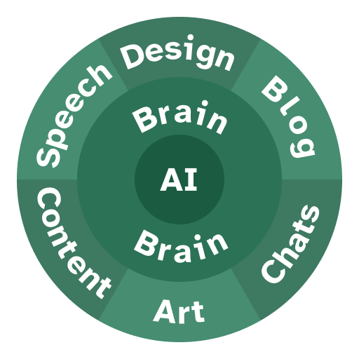

Es sind mehr als zweieinhalb Jahre seit der Veröffentlichung von ChatGPT vergangen. Der 30. November 2022 markierte den Beginn einer neuen Ära: den Start der KI. Heutzutage nutzen viele Berufe und Menschen im Privatleben, insbesondere im IT-Sektor, KI täglich. Und wir wissen nicht einmal, wo wir uns im Gartner Hype Cycle befinden oder ob sich KI gemäß Kurzweils „Gesetz der beschleunigten Rückkehr“ weiterentwickeln wird.

Der Trend steigt weiterhin, aber gleichzeitig habe ich eine leichte, aber stetige Verschlechterung des Wissens auf menschlicher Ebene bemerkt, da die Menschen immer mehr kreative Arbeit an KI delegieren. Deshalb habe ich mich entschlossen, diesen kleinen Blogbeitrag zu schreiben, um meine Gedanken zu teilen und zu versuchen, den übermäßigen Einsatz von Künstlicher Intelligenz, der unsere kognitiven Fähigkeiten ruinieren würde, zu entmutigen. Und obwohl ich weiß, dass nur wenige Menschen dies lesen werden, hält mich das nicht davon ab, es zu versuchen. Andernfalls hätte ich möglicherweise meine Chance verpasst, der Zukunft der Menschheit zu helfen.

{/* excerpt */}

> **Hinweis**: Dieser gesamte Blogpost basiert auf meinen Beobachtungen der Entwicklungen von sozialen Veränderungen, mit einem besonderen Fokus auf die Nutzung von Künstlicher Intelligenz aus meiner Sicht. Er ist daher stark subjektiv geprägt. Ich habe keine Studien hinzugezogen, die meine Meinung belegen oder widerlegen könnten.

## Wie Menschen dazu neigen, KI zu nutzen

KI ist großartig. Das möchte ich gar nicht infrage stellen. Sie hat mir geholfen und hilft mir immer noch, meinen Arbeitsablauf zu verbessern, neues Wissen zu sammeln, in neue Bereiche einzutauchen und neue Technologien zu erkunden. Für Menschen, die sich nicht dafür interessieren, wie KI funktioniert, wirken solche intelligenten Tools wie Magie. Es macht mir Freude, ihre funkelnden Augen und offenen Münder zu sehen, wenn ich ihnen erkläre, dass alles, worauf KI basiert, Wahrscheinlichkeit ist. Welches Wort am wahrscheinlichsten als nächstes auf Eigenschaften und Emotionen in einem hochdimensionalen virtuellen Raum folgt. [Aber das ist ein anderes Thema.](https://www.youtube.com/watch?v=LPZh9BOjkQs)

Worauf ich mich konzentrieren möchte, ist, wie Menschen in den letzten Monaten – wenn nicht sogar Jahren – angefangen haben, KI zu nutzen. Da unser Gehirn von Natur aus faul ist, neigen wir dazu, mehr Arbeit an KI auszulagern, je weniger wir uns auf eine spezifische Aufgabe fokussieren. Mit anderen Worten: Wenn du dich nicht vollständig deinem aktuellen Projekt widmest, bist du wahrscheinlich kurz davor, es einfach einer KI zu übergeben. Ein anderer potenzieller Grund für das Auslagern von Arbeit in die KI-Welt ist die Unwissenheit über die zugrunde liegenden Technologien, was es schwierig macht, eigene Lösungen zu entwickeln.

Ich bin keineswegs Wissenschaftler, aber ich denke, dass das Zusehen, wie KI deine Arbeit erledigt – weil das Ergebnis deiner eigenen Unfähigkeit nicht mit deiner Vision übereinstimmt – dir so viel Dopamin verschafft, dass dein Gehirn es immer häufiger tun möchte. Darüber hinaus strebt der Mensch als soziales Wesen immer danach, mit jemandem verbunden zu sein, und die Interaktion mit KI befriedigt dieses Bedürfnis. Dieses Verhalten ist für unser Gehirn typisch und tritt auch beim Konsumieren von Sozialen Medien oder expliziten Inhalten auf. Es ist tief in unserer Großhirnrinde verankert, und die gesamte Gaming- und Unterhaltungsindustrie nutzt es skrupellos, um ihre Einnahmen zu maximieren.

Ich habe diesen Trend auch bei mir selbst bemerkt, wie man deutlich aus [einigen meiner Beiträge, bei denen ich zugebe, KI verwendet zu haben](../../blog/authors/artificial-intelligence/), um sie zu verfassen, erkennen kann. Aber ich finde, das ist keine Schande. Jeder Content Creator, der KI einsetzt, sollte aus erster Hand die Fallstricke des direkten Erstellens von Inhalten für den Leser oder Zuschauer erleben, um zu erkennen, wie wenig er letztlich über das Thema weiß. Dies ermöglicht ihnen, aus ihren Fehlern zu lernen und sich bewusst zu werden, wie einfach Faulheit zu einem so verachteten Weg führen kann. Nur die Exzellenten unter uns strebten die ganze Zeit nach handgefertigten Inhalten.

## Negative Nebenwirkungen

Ich habe die Hauptnachteile des übermäßigen Einsatzes von KI, die mir aufgefallen sind, hervorgehoben. Jetzt werde ich zwei kleinere Gründe anführen, die ich bei mir selbst beobachtet habe, warum man KI nicht für kreative Arbeit nutzen sollte.

### Rückgang der Kommunikation

Während ich ein Werbevideo von "The Browser Company™" ansah (siehe den letzten Link im [Ressourcenabschnitt unten](#resources-with-better-evidence)), bemerkte ich, dass Visionen heutzutage sehr weit auseinanderliegen können. Ich sehe diesen Trend nicht nur im Dia-Browser, sondern in vielen verschiedenen Aspekten der Technologie und in Teilen unseres Lebens. Eine Seite des Trends möchte KI überall dort integrieren, wo es möglich ist, und unsere Abhängigkeit davon erweitern. Ein Beispiel ist die Nutzung von KI, um Nachrichten an unsere engsten Freunde und Kollegen zu verfassen, weil es uns effizienter macht. Ich glaube, dass uns das langfristig einfach nur dumm macht.

Wenn Menschen ihr Gehirn nicht trainieren, Worte für die Kommunikation zu finden, nützliche Sätze zu bilden und Bedeutungen zu schaffen, die von anderen Menschen verstanden werden können, wird unsere Grundlage der Interaktion miteinander zerstört, und wir wären wieder auf dem Niveau von *Homo habilis* – der letzten Spezies, die vermutlich nicht vollständig entwickelte verbale Sprache nutzte. Du siehst, ich habe KI genutzt, um diesen bestimmten Punkt zu recherchieren, aber ich habe meine Worte bewusst gewählt, um mich auszudrücken. Auf diese Weise habe ich nicht nur etwas Neues gelernt, sondern kann es jetzt auch behalten. Eine Fähigkeit, die du niemals haben wirst, wenn du das Schreiben an KI auslagerst.

### Einsamkeit

Alleinsein auf mentaler Ebene ist meiner Meinung nach eine der am meisten unterschätzten modernen Gefahren der Gesellschaft. Das Ironische daran ist, dass, wenn jeder alleine ist, wir alle etwas gemeinsam haben und somit nicht wirklich mit unserer eigenen Einsamkeit alleine wären. Aber wieder schweifen meine Gedanken in andere Gefilde ab.

KI ermutigt uns stark dazu, alleine zu sein. Sie ~~agiert~~ wurde absichtlich so trainiert, dass sie wie ein perfekter Freund, Kollege oder wie auch immer man sie nennen möchte, handelt. Kürzlich habe ich festgestellt, dass die Antworten von ChatGPT explizit meinen Namen enthalten, was mich auf mehreren Ebenen sehr merkwürdig anfühlt. Man könnte argumentieren, dass dies eine private künstliche Form des Doxings darstellt, was natürlich in sich ein Oxymoron ist, da Doxing per Definition öffentlich ist. Dennoch, je mehr man KI nutzt, desto *öfter* möchte man KI nutzen. Besonders nach der Einführung von KI-Voice-Modi stieg dieser Trend ohne Ende weiter. Herzlichen Glückwunsch ClosedAI, ihr habt die Sucht neu erfunden.

Im schlimmsten Fall kann dies dazu führen, dass Menschen Angst haben, mit anderen Menschen zu sprechen. Freundschaften aufgeben. Sich aus der Gesellschaft zurückziehen. Solche Gewohnheiten sind ernsthafte Probleme und sollten am besten von einem Arzt oder Psychologen untersucht werden.

## Vorschlag eines Schichtenmodells zur KI-Nutzung

Eine globale Lösung für alle Menschen für ein solches Problem vorzuschlagen, ist unmöglich. Da jede Person ihre eigenen Erfahrungen mit KI, ihre eigenen Gedanken und Gefühle hat, sei es als Optimist oder Pessimist, kann ich nicht für alle sprechen. Tatsächlich denke ich, dass ich nur für mich selbst sprechen, lernen und meine eigenen Wege im Umgang mit und der Begrenzung meiner KI-Nutzung teilen kann und hoffe, dass diese Erfahrungen auch dir helfen können.

Meine idealen Erfahrungen mit KI – der optimale goldene Mittelweg zwischen dem übermäßigen Einsatz von KI, der kognitiven Erosion zur Folge hat, und dem Ignorieren des Hypes ohne die daraus resultierenden Vorteile zu nutzen – wäre, KI [genau dann und nur dann](https://de.wikipedia.org/wiki/Genau_dann,_wenn) einzusetzen, wenn du und nur du daraus Vorteile ziehst. Mit anderen Worten, kontrolliere deine Nutzung und beschränke sie in einem solchen Maße, dass nur du jemals mit den von der KI erzeugten Inhalten in Kontakt kommst. Eine solche Einschränkung hat viele Konsequenzen. Hier sind einige Beispiele, um zu verdeutlichen und zu betonen, was ich meine:

* Nutze KI für persönliche Lernsitzungen: Wenn du dich zunächst in ein neues, völlig unbekanntes Thema einarbeiten möchtest, kann dir KI allgemeine Übersichten geben und Verbindungen zu anderen Wissensbereichen und praktischen Anwendungsgebieten aufzeigen. Obwohl dies nicht unbedingt bedeutet, dass du wirklich schneller oder effizienter lernst, hilft es dabei, den ersten Schritt zu machen und ins Rollen zu kommen.
* Nutze KI für dumme und sich wiederholende Arbeitslasten und bitte um Hilfe, wenn du sicher bist, dass das Problem oder die Aufgabe bereits tausende Male von anderen gelöst wurde. Aktuelle LLMs basieren auf vorhandenen Daten, was bedeutet, dass sie darauf ausgelegt sind, bereits gelöste Probleme gut zu bewältigen, nicht das Rad neu zu erfinden, sondern vorzuschlagen, das bestehende runde Instrument zu nutzen.

 

* Verwenden Sie keine KI, um sich anderen Menschen mitzuteilen. Denken Sie darüber nach, welche Bedeutung Sie vermitteln, welches Wissen Sie teilen möchten, und fassen Sie Ihre Gedanken in Ihre eigenen Worte. Dies hilft Ihnen enorm, Ihre eigenen Gedanken zu festigen, sich zu merken, was Sie gelernt haben, und sich viel besser zu fühlen.
* Verwenden Sie keine KI, um komplexe und kreative Arbeiten zu erstellen. Heutzutage gibt es Hunderte – wahrscheinlich Tausende – von Tools, die Ihnen helfen, Kunst, Musik, Code, Designs, Pläne usw. mithilfe von KI oder vollständig mit KI zu erstellen. Obwohl dies den Anschein erweckt, dass Sie produktiver sein können, werden Sie umso unwissender, je häufiger Sie auf diese Methoden zurückgreifen, anstatt das zu tun, was Sie selbst gerne tun. Es ist völlig in Ordnung zu sagen, dass kleine Teile der Arbeit an die KI ausgelagert werden können, hauptsächlich wiederholende Aufgaben, die manuell einfach mehr Zeit in Anspruch nehmen. Kreative und originelle Arbeiten sollten jedoch menschlich bleiben und mit Liebe gemacht werden. Wenn Ihnen überhaupt nicht gefällt, was Sie tun, ist dies ein Signal dafür, dass Sie es wahrscheinlich ganz aufgeben sollten.
* Lassen Sie sich nicht von all dem glänzenden KI-Zeug verführen, das es da draußen gibt. Tools wie [Lovable](https://lovable.dev), [GitHub Copilot](https://github.com/features/copilot), [Cursor](https://cursor.com/en), [ChatGPT Voice](https://openai.com/index/chatgpt-can-now-see-hear-and-speak/) und neu dabei: [GPT-5](https://academy.openai.com/public/resources/intro-gpt-5), um nur einige zu nennen, wollen Sie tatsächlich gar nicht unterstützen. Sie wollen entweder direkt Ihre Daten oder Ihren Workflow kontrollieren, sodass Sie nicht entkommen können, sobald Sie sich daran gewöhnt haben. Leider gewöhnen sich Menschen erstaunlich schnell an KI.

Kurz gesagt: Meine Meinung ist, dass KI für das Brainstorming und die Unterstützung jedes Einzelnen bei der Erstellung eines Endprodukts genutzt werden sollte – nicht zu verwechseln mit dem Erstellen des Endprodukts durch die KI –, jedoch nicht für die Kommunikation mit anderen Menschen und die Endergebnisse selbst (z. B. Bilderstellung, Blogs schreiben, Beiträge in sozialen Medien, Kommunikation in Chats, Motivationsreden, Aufsätze usw.). Meiner Meinung nach kann sich das menschliche Gehirn nur durch eigene Fehler und Erfahrungen weiterentwickeln und lernen. Und Sie können niemals aus Ihren Fehlern lernen, wenn tatsächlich die KI sie gemacht hat.

> KI hat ihren Platz in der Ideenfindung, aber expressive Arbeit sollte menschlich bleiben.

### Das Paradigma

Ich habe vor Kurzem ein Software-Design-Muster namens „Onion Architecture“ entdeckt. Um die Erklärung kurz zu halten: Das Hauptprinzip dieser Architektur ist die Unterteilung in Schichten, wobei jede Schicht nur mit ihren beiden Nachbarn verbunden ist (ausgenommen Geschwister), der inneren und der äußeren Schicht.

Um dieses Paradigma auf den aktuellen Kontext zu übertragen, können Sie sich die KI als ein Werkzeug vorstellen, das Ihnen zur Verfügung steht und das mit allen anderen Teilen unverbunden ist, indem es nur von Ihrem Gehirn umgeben ist. Nur Ihr Gehirn kann auf die äußeren Schichten zugreifen, sie manipulieren, erstellen und verändern – in diesem Beispiel Blogs schreiben, Inhalte erstellen, mit Menschen über Chats oder Reden kommunizieren oder sich mit Kunst oder Design ausdrücken.

Hier sehen Sie ein Bild, das meine Vorstellung von einer begrenzten, aber idealen Nutzung der KI darstellt:

Ob ein solcher architektonischer Ansatz und das Paradigma in diesem Zusammenhang optimal oder nur subjektiv sind, kann in den Kommentaren unten kritisiert werden.

## Fazit

Wie ich zu Beginn gesagt habe, ist dieser Blogpost sehr subjektiv und zielt lediglich darauf ab, meine Erfahrungen mit allen zu teilen, damit Sie auch aus meinen Fehlern lernen, Ihre eigene Nutzung der KI optimieren und sie besser unter Kontrolle bekommen können. Am Ende können Sie tun, was Sie wollen, aber seien Sie sich des Abbaus Ihres eigenen Gehirns bewusst, wenn Sie ebenfalls in die Falle der Übernutzung geraten.

Eine Anmerkung noch: Es hat mich mehrere Monate gekostet, diesen Blogpost zu schreiben, zu verfeinern und wieder von Grund auf neu zu beginnen. Kein Blog ist perfekt, wie Sie bei diesem vielleicht bemerkt haben. Es gibt wahrscheinlich einige grammatikalische Fehler hier und da, einige Sätze, die eigentlich keinen Sinn ergeben, aber genau das macht uns menschlich. Zudem gibt es sehr wahrscheinlich viele starke Meinungen in diesem Blog, bei denen Sie völlig widersprechen und ganz anderer Meinung sein würden (ich freue mich auf Ihre Kommentare, die Ihre Empörung zum Ausdruck bringen.), aber genau das macht mich aus. Mein Gehirn, meine Gedanken, meine Meinung.

> „Errare humanum est“

## Ressourcen mit besseren Beweisen

Wenn Sie an Artikeln interessiert sind, die auf wissenschaftlicheren Studien oder Ansätzen basieren, lesen Sie gerne einige davon oder alle. Sie sind in keiner bestimmten Reihenfolge, also fangen Sie einfach in der Mitte an und arbeiten sich nach oben oder unten vor. 😊

* [AI: Artificial Incompetence](https://lou.gg/blog/ai-artificial-incompetence)
* [KI-Codierungstools machen Entwickler langsamer, aber sie denken, sie seien schneller, ergibt eine Studie.](https://www.theregister.com/AMP/2025/07/11/ai_code_tools_slow_down/)
* [Unternehmen, die mit KI Geld sparen wollten, geben nun ein Vermögen aus, um die Fehler zu beheben.](https://futurism.com/companies-fixing-ai-replacement-mistakes)
* [Linus Torvalds meint, KI sei „90 % Marketing und 10 % Realität“.](https://www.tomshardware.com/tech-industry/artificial-intelligence/linus-torvalds-reckons-ai-is-90-percent-marketing-and-10-percent-reality)
* [Die Situation mit der KI-Freundin ist TRAURIG (YouTube.com)](https://www.youtube.com/watch?v=Ftt5KqJ5D0Q)
* [Macht KI dumm?](https://www.economist.com/science-and-technology/2025/07/16/will-ai-make-you-stupid)
* [KI macht uns nicht produktiver. Sie macht uns kognitiv bankrott. (X.com)](https://x.com/itsalexvacca/status/1935343874421178762)
* [Von generativer KI abhängig sein.](https://www.forbes.com/sites/lanceeliot/2024/08/24/being-addicted-to-generative-ai/)
* [Eine weitere Studie zeigt, dass KI uns dumm macht.](https://tech.co/news/another-study-ai-making-us-dumb)
* [Macht KI uns intelligenter oder dümmer?… Oder künstlich intelligenter? (KI-symbiotische Krise)](https://cognitiontoday.com/is-ai-making-us-smarter-or-dumber-or-artificially-smarter/)
* [Research: Gen AI Makes People More Productive—and Less Motivated](https://hbr.org/2025/05/research-gen-ai-makes-people-more-productive-and-less-motivated)
* [Die mächtigsten Wege, um unseren neuen Dia-Browser zu „hacken“ (YouTube.com)](https://www.youtube.com/watch?v=JCZUIm4S9QQ)

Viel Spaß beim Lesen!
