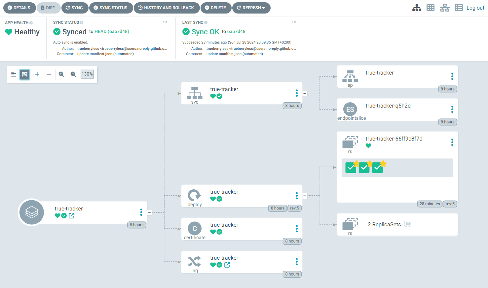

Nachdem wir Vegard S. Hagens Artikel "[Argo CD Kustomize mit Helm](https://blog.stonegarden.dev/articles/2023/09/argocd-kustomize-with-helm/)" gelesen und uns entschieden haben, dass deren Lösung nicht der richtige Weg für unseren Cluster ist, haben wir uns direkt in den Standard "Getting Started"-Leitfaden von Argo CD gestürzt („[Getting started](https://argo-cd.readthedocs.io/en/stable/getting_started/)”). Und jetzt führen wir Sie durch die Herausforderungen, Argo CD auf k3s und Cilium einzurichten, indem wir dort anknüpfen, wo wir im Kapitel "[Setup Certificate Manager mit Cloudflare](../../blog/setup-kubernetes-with-cilium-and-cloudflare#setup-certificate-manager-with-cloudflare/)" unseres letzten Blogposts "[Setting up Kubernetes with Cilium and Cloudflare](../../blog/setup-kubernetes-with-cilium-and-cloudflare/)" aufgehört haben. In genau diesem jüngsten Blogpost haben wir auch [Keel](https://keel.sh/) am Ende eingerichtet, aber diesen Schritt benötigen wir jetzt nicht mehr, da wir Argo CD verwenden werden, um den neuesten Stand der Technik aus jedem GitHub-Repo abzurufen. Viel Spaß beim Lesen!

:::note
Wir gehen davon aus, dass Sie [unserem anderen Blogpost](../../blog/setup-kubernetes-with-cilium-and-cloudflare/) gefolgt sind.
:::

## Anforderungen

Bevor wir beginnen können, müssen wir sicherstellen, dass `kubectl` installiert ist, eine Kubeconfig-Datei vorhanden ist (k3s speichert diese Datei hier:

```yaml
#/etc/rancher/k3s/config.yaml
flannel-backend: "none"
disable-kube-proxy: true
disable-network-policy: true
cluster-init: true
disable:
    - servicelb
    - traefik
```

) und CoreDNS (überprüfen Sie, ob Sie CoreDNS haben, indem Sie folgenden Befehl ausführen:

```bash
kubectl get pods -n kube-system -l k8s-app=kube-dns
```

Befehl).

## Installation

Zuerst wenden wir alle notwendigen Dienste, Deployments und viele andere verschiedene Kubernetes-Ressourcen an, indem wir folgendes ausführen:

```bash
kubectl create namespace argocd
kubectl apply -n argocd -f https://raw.githubusercontent.com/argoproj/argo-cd/stable/manifests/install.yaml
```

## Zertifikat

Zusätzlich benötigen wir ein Zertifikat:

```yaml
apiVersion: cert-manager.io/v1
kind: Certificate
metadata:
    name: argocd
    namespace: argocd
spec:
    secretName: argocd
    issuerRef:
        name: acme-issuer
        kind: ClusterIssuer
    dnsNames:
        - "argo-cd.trueberryless.org"
```

Wenden Sie diese Ressource an, indem Sie `kubectl apply -f certificate.yaml` ausführen.

## Ingress-Controller

Und wir benötigen einen Ingress-Controller, der von Cilium verwaltet wird:

```yaml
apiVersion: networking.k8s.io/v1
kind: Ingress
metadata:
    name: argocd-ingress
    namespace: argocd
spec:
    rules:
        - host: argo-cd.trueberryless.org
          http:
              paths:
                  - path: /
                    pathType: Prefix
                    backend:
                        service:
                            name: argocd-server
                            port:
                                number: 80

    tls:
        - hosts:
              - argo-cd.trueberryless.org
          secretName: argocd
```

Wenden Sie diese Ressource an, indem Sie `kubectl apply -f argocd-ingress.yaml` ausführen.

## TLS innerhalb von Argo CD deaktivieren

Mit dem Zertifikat ist die Verbindung zwischen Client und Server gesichert. Es gibt jedoch noch ein selbstsigniertes Zertifikat innerhalb der Argo-CD-Dienste, das wir nicht unbedingt benötigen. Wir können daher die Sicherheit des Argo-CD-Servers durch Bearbeiten der Eigenschaft `server.insecure` deaktivieren.

Um das zu tun, führen wir zunächst diesen Befehl aus:

```bash
kubectl edit cm argocd-cmd-params-cm -n argocd
```

was hoffentlich eine Datei in vim oder neovim öffnet (ansonsten wäre das unangenehm, wenn Sie uns fragen, LMAO). Die Datei sollte etwa so aussehen:

```yaml {21-22}
# Please edit the object below. Lines beginning with a '#' will be ignored,
# and an empty file will abort the edit. If an error occurs while saving this file will be
# reopened with the relevant failures.
#
apiVersion: v1
data:
    server.insecure: "true"
kind: ConfigMap
metadata:
    annotations:
        kubectl.kubernetes.io/last-applied-configuration: |
            {"apiVersion":"v1","kind":"ConfigMap","metadata":{"annotations":{},"labels":{"app.kubernetes.io/name":"argocd-cmd-params-cm","app.kubernetes.io/part-of":"argocd"},"name":"arg
    creationTimestamp: "2024-07-27T11:15:28Z"
    labels:
        app.kubernetes.io/name: argocd-cmd-params-cm
        app.kubernetes.io/part-of: argocd
    name: argocd-cmd-params-cm
    namespace: argocd
    resourceVersion: "239710156"
    uid: 5f53d26b-3adf-4ed9-9807-c3da847335a2
data:
    server.insecure: "true"
```

Die letzten beiden Zeilen werden wahrscheinlich zunächst nicht vorhanden sein, aber genau diese Einstellung möchten wir erreichen. Fügen Sie diese zwei Zeilen hinzu (wie oben markiert) und speichern Sie die Datei (`Esc` → `:wq`, wenn Sie cool sind).

Starten Sie den Argo-CD-Server neu, indem Sie dies ausführen und warten, bis das Rollout abgeschlossen ist:

```bash
kubectl rollout restart deploy argocd-server -n argocd
kubectl rollout status deploy argocd-server -n argocd
```

Nach all diesen Schritten sollten wir nun die Benutzeroberfläche unter [`https://argo-cd.trueberryless.org`](https://argo-cd.trueberryless.org) sehen (passwortgeschützt).


:::note
Die Anmeldedaten der Argo-CD-Benutzeroberfläche bestehen aus einem Benutzer und einem Passwort. Der Benutzer ist immer `admin`, und das Passwort können Sie mit folgendem Befehl abrufen:

```bash
kubectl -n argocd get secret argocd-initial-admin-secret -o jsonpath="{.data.password}" | base64 -d
```
:::

## Manifest zum Repository hinzufügen

Um eine neue Anwendung in Argo CD zu erstellen (entweder über das UI oder CLI — wir verwenden das UI, da wir das CLI nicht eingerichtet haben), müssen wir das Git-Repository vorbereiten. Da das Repository die einzige Quelle der Wahrheit ist, definieren wir hier alle Kubernetes-Ressourcen, die von Argo CD erstellt werden sollen.

Wir empfehlen, einen neuen Ordner im Git-Repository zu erstellen, der z. B. `manifest` heißt. In diesem Ordner erstellen wir einige Dateien:

* `certificate.yaml`:

  ```yaml
  apiVersion: cert-manager.io/v1
  kind: Certificate
  metadata:
  name: mutanuq
  namespace: mutanuq
  spec:
  secretName: mutanuq
  issuerRef:
      name: acme-issuer
      kind: ClusterIssuer
  dnsNames:
      - "mutanuq.trueberryless.org"
  ```

* `deployment.yaml`:

  ```yaml
  apiVersion: apps/v1
  kind: Deployment
  metadata:
      name: mutanuq
      namespace: mutanuq
      labels:
          app: mutanuq
  spec:
      replicas: 3
      selector:
          matchLabels:
              app: mutanuq
      template:
          metadata:
              labels:
                  app: mutanuq
          spec:
              containers:
                  - name: mutanuq
                  image: "trueberryless/mutanuq"
                  imagePullPolicy: Always
  ```

* `service.yaml`:

  ```yaml
  apiVersion: v1
  kind: Service
  metadata:
  name: mutanuq
  namespace: mutanuq
  annotations:
      cert-manager.io/issuer: acme-issuer
  spec:
  selector:
      app: mutanuq
  ports:
      - name: http
      port: 80
  ```

* `ingress.yaml`:

  ```yaml
  apiVersion: networking.k8s.io/v1
  kind: Ingress
  metadata:
  name: mutanuq
  namespace: mutanuq
  spec:
  rules:
      - host: mutanuq.trueberryless.org
      http:
          paths:
          - path: /
              pathType: Prefix
              backend:
              service:
                  name: mutanuq
                  port:
                  number: 80

  tls:
  - hosts:
      - mutanuq.trueberryless.org
      secretName: mutanuq
  ```

Diese Dateien sind im Grunde genau die gleichen, die im [anderen Beitrag](../../blog/setup-kubernetes-with-cilium-and-cloudflare#example-app-mutanuq/) erwähnt werden, jedoch in vier Dateien aufgeteilt, da dies den Vorteil bietet, das Manifest über GitHub Actions manipulieren zu können. Aber der Reihe nach: Sie lernen im [nächsten Beitrag](../../blog/setup-continuous-integration-github-repository/), wie Sie das Manifest mit GitHub Actions einrichten können.

## Neue Anwendung in der Argo-CD-Benutzeroberfläche erstellen

Sie werden wahrscheinlich den großen `NEW APP`-Button in der Argo-CD-Benutzeroberfläche sehen. Klicken Sie darauf und erstellen Sie eine neue Anwendung mit den unten angepassten Eigenschaften:

* Anwendungsname: `mutanuq`
* Projektname: `default`
* Synchronisationsrichtlinie: Erfahren Sie mehr in [diesem Beitrag](../../blog/setup-continuous-integration-github-repository/) / vorerst auf `Manuell` belassen
* Repository-URL: `https://github.com/trueberryless-org/mutanuq`
* Revision: `HEAD`
* Pfad: `manifest`
* Cluster-URL: `https://kubernetes.default.svc`
* Namespace: `mutanuq`

Optional — wenn Sie [das CLI installiert](https://argo-cd.readthedocs.io/en/stable/cli_installation/) haben — können Sie diesen Befehl ausführen, um dasselbe Ergebnis zu erhalten:

```bash
argocd app create mutanuq \
  --project default \
  --repo https://github.com/trueberryless-org/mutanuq \
  --revision HEAD \
  --path manifest \
  --dest-server https://kubernetes.default.svc \
  --dest-namespace mutanuq
```

Nun können Sie hoffentlich sehen, dass Ihre Website über die Benutzeroberfläche bereitgestellt wird. Dieser Prozess kann einige Zeit dauern, da z. B. die Zertifikatanfrage genehmigt werden muss. Eine gesunde Anwendung sollte etwa so aussehen:



## Feiern mit einem Kaffee!

Herzlichen Glückwunsch, Sie haben Argo CD erfolgreich mit k3s und Cilium eingerichtet! Sie haben sich eine Kaffeepause redlich verdient. Genießen Sie eine wohlverdiente Tasse, und wenn Sie mir virtuell einen Kaffee spendieren möchten, können Sie meine Arbeit gerne auf [Ko-fi](https://ko-fi.com/trueberryless) unterstützen. Vielen Dank!

## Fortsetzung

Fortsetzung folgt in unserem [nächsten Blog](../../blog/setup-continuous-integration-github-repository/), der beschreibt, wie man ein GitHub-Repository einrichtet, das anschließend über Argo CD bereitgestellt werden kann.
