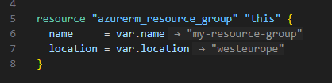

import { FileTree, LinkButton } from "@astrojs/starlight/components"

Heute möchte ich über eine kleine VS Code-Erweiterung sprechen, die ich an einem einzigen Tag vibe-codiert habe, um die Arbeit mit Terraform zu erleichtern. Zunächst erkläre ich, was Terraform ist, und gehe dann direkt auf die Funktionalität und die Gründe für diese Erweiterung ein. Fühlen Sie sich frei, den ersten Abschnitt zu überspringen, wenn Sie bereits mit Terraform vertraut sind.

{/* excerpt */}

## Was ist Terraform?

Terraform ist ein Infrastructure-as-Code (IaC)-Tool, mit dem Sie Ihre gesamte Cloud- oder On-Premises-Infrastruktur als Code definieren können. Die von [HashiCorp](https://github.com/hashicorp) entwickelte Konfigurationssprache wird als HCL (HashiCorp Configuration Language) bezeichnet und bietet eine intuitive, menschenlesbare Syntax. Die *native Syntax* hat den Vorteil, dass die Lernkurve niedrig ist, sie für alle Anbieter konsistent ist und angenehm für Menschen zu lesen und zu schreiben ist, während die JSON-basierte Variante für Maschinen einfacher zu generieren und zu parsen ist.

Was Terraform sehr leistungsfähig macht, sind zwei grundlegende Funktionen: **Variablen** und **Module**. Variablen ermöglichen es, Ressourcen zu erstellen, bei denen die tatsächlichen Werte von anderswoher eingefügt werden können, und Module gruppieren eine beliebige Anzahl von Ressourcen, was den Vorteil der Wiederverwendbarkeit und Verschachtelung hat. Während beide Funktionen sehr grundlegend erscheinen, bilden sie in Kombination ein Traumteam. Denn die Offenheit von Terraform ermöglicht es, Eingabevariablen für jedes Modul zu definieren und Variablen auch über Ausgaben zu exportieren.

Ein einfaches Modul ist daher wie folgt aufgebaut:

<FileTree>
  * azure-resource-group/
    * main.tf
    * variables.tf
    * outputs.tf
    * README.md
</FileTree>

Alle Dateien außer `main.tf` sind optional (die `README.md` ist nicht spezifisch für Terraform), aber ich bevorzuge es, Best Practices zu folgen, daher beinhaltet das Beispiel diese Dateien.

Schauen wir uns ein einfaches Beispiel an. Nehmen wir an, wir möchten eine Ressourcengruppe in Azure mit Terraform verwalten. In der Datei `variables.tf` definieren wir, welche Eingaben wir innerhalb des Moduls erwarten. Jeder der beiden Blöcke repräsentiert die Variable und die Eigenschaften der Variablen, wie die `description` oder den `type`:

```hcl
// variables.tf
variable "name" {
  description = "Name of the resource group"
  type        = string
}

variable "location" {
  description = "Azure region"
  type        = string
  default     = "westeurope"
}
```

Sie haben vielleicht bemerkt, dass die Variable `location` auch eine `default`-Eigenschaft hat, die die Variable optional macht und einen Fallback-Wert bietet, falls keiner angegeben wird. Diese Variablen können dann innerhalb der Datei `main.tf` verwendet werden. Hier definieren wir die tatsächlichen Ressourcen, die wir generieren möchten:

```hcl
// main.tf
provider "azurerm" {
  features {}
}

resource "azurerm_resource_group" "this" {
  name     = var.name
  location = var.location
}
```

In diesem Fall definieren wir einfach unsere Ressourcengruppe, die Sie sich wie einen Ordner in Azure vorstellen können – eine sehr laienhafte Erklärung. Der letzte Teil, den wir umsetzen können, ist die Datei `outputs.tf`:

```hcl
// outputs.tf
output "resource_group_id" {
  description = "The ID of the resource group"
  value       = azurerm_resource_group.this.id
}
```

Dies ist sehr nützlich, wenn wir Informationen wie die ID der Ressourcengruppe später in anderen Teilen unseres Terraform-Projekts verwenden möchten.

Wie ich bereits geschrieben habe, ist die `README.md` tatsächlich kein Teil der Terraform-Definitionen, hilft uns jedoch, den Zweck des Moduls zu verstehen:

````md
# Azure Resource Group Module

A minimal Terraform module that creates an Azure Resource Group.

## Usage

```hcl
module "rg" {
  source = "./azure-resource-group"
  name   = "my-resource-group"
}
```
````

Wie die `README.md` bereits andeutet, können wir dieses Modul jetzt verwenden, um eine Azure-Ressourcengruppe überall innerhalb unseres Projekts zu erstellen. Wir müssen nur sicherstellen, dass der Pfad zum Modul-Ordner korrekt ist und Terraform die Dateien `main.tf`, `variables.tf` und `outputs.tf` interpretieren kann. In diesem Fall, da wir die Variable `location` nicht angeben, wird sie auf `"westeurope"` gesetzt.

```hcl
module "rg" {
  source = "./azure-resource-group"
  name   = "my-resource-group"
}
```

Ich hoffe, dieser Abschnitt hat Ihnen ein besseres grundlegendes Verständnis dafür gegeben, was Terraform ist und was Sie damit tun können.

## Die mühsame Aufgabe mit Terraform

Sie haben vielleicht bemerkt, dass das Feld `source` eines Moduls eine erstaunliche Flexibilität für das gesamte Projekt schafft, da Sie Module überall definieren und überall im Projekt verwenden können.

Dieses Feature hat jedoch einen großen Nachteil in Bezug auf die Wartbarkeit: Das Auflösen der tatsächlichen Werte hinter Variablen kann sehr mühsam sein. Während es in diesem einfachen Beispiel leicht zu verwalten scheint, desto größer das Projekt wird und je verschachtelter es ist, desto schwieriger und zeitaufwändiger wird das Verstehen und Anpassen von Terraform-Code. Deshalb habe ich eine Erweiterung erstellt.

**Was sollte die Erweiterung tun?** Das Hauptziel der Erweiterung ist es, die tatsächlichen Werte der Variablen überall dort bereitzustellen, wo sie verwendet werden. Wenn ein Modul von mehreren Stellen oder einfach mehreren Malen aufgerufen wird, sollten die Informationen bereitstellen, welcher Anwendungsfall die Variable auf welchen Wert setzt. Wenn Module tief verschachtelt sind, sollten die Werte aufgelöst werden, bis wir die `.tfvars`-Dateien erreichen. Dies sind die Dateien, in denen Sie die fest kodierten Werte für Variablen definieren können.

## So starten Sie eine VS Code-Erweiterung

Das Erstellen des grundlegenden Template-Projekts für eine VS Code-Erweiterung ist so einfach wie das Ausführen dieses Befehls, wenn Sie [Node](https://github.com/nodejs) installiert haben:

```bash
npx --package yo --package generator-code -- yo code
```

Dieser Befehl installiert temporär Yeoman (eine Generator-Software) und öffnet einen interaktiven Modus, in dem einige Fragen beantwortet werden müssen, wie der Projektname, der Typ und die Beschreibung. Im folgenden Block sehen Sie alle Fragen und Standardantworten:

```bash
# ? What type of extension do you want to create? New Extension (TypeScript)
# ? What's the name of your extension? HelloWorld
### Press <Enter> to choose default for all options below ###

# ? What's the identifier of your extension? helloworld
# ? What's the description of your extension? LEAVE BLANK
# ? Initialize a git repository? Y
# ? Which bundler to use? unbundled
# ? Which package manager to use? npm

# ? Do you want to open the new folder with Visual Studio Code? Open with `code`
```

Weitere Informationen zu VS Code-Erweiterungen möchte ich im [offiziellen Dokumentation](https://code.visualstudio.com/api/get-started/your-first-extension) verlinken, da sie immer aktueller im Gegensatz zu meinen Erklärungen hier ist.

## 3… 2… 1… Vibe-Coding!

Ich beginne gerne neue Projekte, indem ich [ChatGPT](https://github.com/openai) nach allgemeinen technischen Fragen frage wie:

* Wie würden Sie vorschlagen, ein solches Projekt umzusetzen?
* Wie lange schätzen Sie, dass es dauern wird?
* Wie schwierig wird es sein?

Das Brainstorming mit KI-Bots scheint ein sehr sinnvoller Weg zu sein, um sich einen besseren Überblick über neue Projekte zu verschaffen, insbesondere wenn man in völlig neue Gewässer eintaucht. Eine VS Code-Erweiterung zu erstellen, war genau ein solcher Anwendungsfall, da ich noch nie zuvor etwas für VS Code oder eine andere IDE erstellt hatte. Nach dieser anfänglichen Brainstorming-Phase bevorzuge ich [Claude](https://github.com/anthropics), um alle notwendigen Dateien für eine solche Erweiterung zu programmieren, da dieser KI-Bot meiner Erfahrung nach in der Lage ist, Code wirklich präzise umzusetzen. Ich habe kaum Fehler oder Laufzeitprobleme mit Claude-Code erlebt, sodass ich ihn genau für solche Anwendungsfälle nutze – Initialstarter. Der Nachteil von Claude ist sein sehr begrenztes kostenloses Testangebot, weshalb ich beim Formulieren meiner Worte immer vorsichtig bin und versuche, im Voraus an so viele mögliche Fehler der KI zu denken wie möglich. So begann es also: Ich nahm mir etwas Zeit, um mein genaues Szenario und meinen Wunsch in die begrenzten Kontextfenster einer zufälligen Wortmaschine namens Claude zu formulieren und erhielt sofort eine riesige `extension.ts`-Implementierung. Natürlich gab es offensichtliche Unterschiede zwischen meiner Vision und der Kommunikation mit diesem LLM, weshalb ich ihm ein weiteres Mal erklären musste, was die wichtigen Überlegungen sind, und um weiteren Code zu erhalten, nutzte ich auch meinen magischen Trick: "Wenn das zu groß für eine Datei ist, geben Sie mir einfach die gesamte `extension.ts` in mehreren Dateien, die natürlich funktionieren sollte."

Claude begab sich dann auf eine lange Reise.

Nach einigen Kämpfen, es weiter am Laufen zu halten, waren meine Tokens aufgebraucht und ich musste den verbleibenden Code selbst herausfinden. Dennoch gelang es mir, eine laufende Version zu erstellen, da nicht viel fehlte, und bemerkte sofort einige Verbesserungen, die bislang unbemerkt geblieben waren. Da ich auf die Wiederauffüllung meiner Tokens warten musste, tat ich genau das.

Am nächsten Morgen begann die Verbesserungssitzung, und nach zwei langen Gesprächen war das Kontextfenster komplett gefüllt, und ich konnte keine Nachrichten mehr im selben Chat senden, obwohl meine Tokens noch nicht abgelaufen waren. Doch alles, was ich von Claude erreichen und erhalten wollte, war nun verfügbar, und ich konnte einige Tests in einem meiner größeren Projekte durchführen. Nachdem ich den Code manuell bestätigt und angepasst hatte, war ich zunächst zufrieden und entschied, dass die erste öffentliche Version fertig war.

Nach einigem Ausprobieren mit [GitHub Actions](https://github.com/github) gelang es mir, den [Publisher für eine VS Code-Erweiterung einzurichten](https://code.visualstudio.com/api/working-with-extensions/publishing-extension#create-a-publisher). Und zwei Patch-Versionen später war ich ziemlich zufrieden mit den Ergebnissen.

## Das Endergebnis

Probieren Sie die Erweiterung selbst aus, indem Sie auf den unten stehenden Button klicken. Es gibt noch viele Verbesserungsmöglichkeiten, also zögern Sie nicht, mitzuhelfen, wenn Sie interessiert sind. Sie können dies gerne auf [GitHub](https://github.com/trueberryless/terraform-variables-resolution) tun.

<LinkButton href="vscode:extension/trueberryless.terraform-variables-resolution">Terraform Variables Resolution installieren</LinkButton>

Hier sehen Sie das Beispiel aus [der Terraform-Erklärung](#what-is-terraform), das zeigt, wie diese Erweiterung die Werte der Variablen visuell in VS Code hinzufügt:


