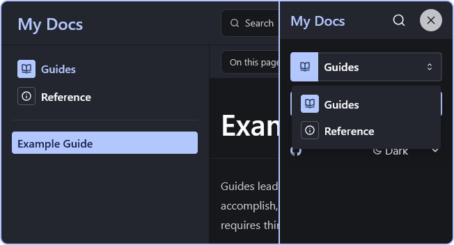

import { Tabs, TabItem } from "@astrojs/starlight/components";

En utilisant le plugin [Starlight Sidebar Topics](https://github.com/hideoo/starlight-sidebar-topics) avec le composant [Starlight Sidebar Topics Dropdown](https://github.com/trueberryless-org/starlight-sidebar-topics-dropdown), vous pouvez créer un site web qui affiche une liste de sujets sur le bureau et un menu déroulant sur mobile.

## Prérequis

Vous devez disposer d’un site web Starlight existant.

## Installer les paquets

Tout d'abord, installez le plugin `starlight-sidebar-topics` ainsi que le composant `starlight-sidebar-topics-dropdown` :

<Tabs syncKey="pkg">
  <TabItem label="npm">
    ```bash
    npm install starlight-sidebar-topics starlight-sidebar-topics-dropdown
    ```
  </TabItem>

  <TabItem label="pnpm">
    ```bash
    pnpm add starlight-sidebar-topics starlight-sidebar-topics-dropdown
    ```
  </TabItem>

  <TabItem label="Yarn">
    ```bash
    yarn add starlight-sidebar-topics starlight-sidebar-topics-dropdown
    ```
  </TabItem>
</Tabs>

Ensuite, suivez les guides d'installation de [Starlight Sidebar Topics](https://starlight-sidebar-topics.trueberryless.org/docs/getting-started/#installation) et de [Starlight Sidebar Topics Dropdown](https://starlight-sidebar-topics-dropdown.trueberryless.org/docs/getting-started/#installation).

## Modifier le composant de la barre latérale

Dans le guide d'installation du composant déroulant, vous avez créé un composant de barre latérale qui ne rend que le menu déroulant. Désormais, vous devez modifier ce composant pour qu'il rende également la barre latérale par défaut si l'utilisateur est sur un bureau.

```astro
---
// src/components/Sidebar.astro
import Default from '@astrojs/starlight/components/Sidebar.astro';
import Topics from 'starlight-sidebar-topics/components/Sidebar.astro';
import TopicsDropdown from 'starlight-sidebar-topics-dropdown/TopicsDropdown.astro';
---

<div class="topics">
  <Topics/>
</div>
<div class="topics-dropdown">
  <TopicsDropdown/>
</div>
<Default><slot /></Default>

<style>
  /* Hide topics by default and show them on medium screens and larger */
  .topics {
    display: none;
  }

  @media (min-width: 800px) {
    .topics {
      display: block;
    }
  }

  /* Show topics dropdown on small screens and hide it on medium screens and larger */
  .topics-dropdown {
    display: block;
  }

  @media (min-width: 800px) {
    .topics-dropdown {
      display: none;
    }
  }
</style>
```

## Résultat

Si vous suivez ces étapes, votre barre latérale ressemblera à ceci :



Vous pouvez trouver le code source complet de ce guide dans cet [exemple StackBlitz](https://stackblitz.com/edit/withastro-starlight-qgraahmp?file=astro.config.mjs).

## Possibilités infinies

Vous pourriez également faire l'inverse (liste sur mobile, menu déroulant sur le bureau) en intervertissant les propriétés `display: block` et `display: none` dans le CSS.

De plus, vous pourriez également créer votre propre composant d'affichage, qui utilise les données de route du plugin Starlight Sidebar Topics et rend les sujets de manière personnalisée. Cela est un peu plus avancé, mais vous pouvez trouver plus d'informations à ce sujet dans la documentation ["Custom Topics List"](https://starlight-sidebar-topics.trueberryless.org/docs/guides/custom-topic-list/).
