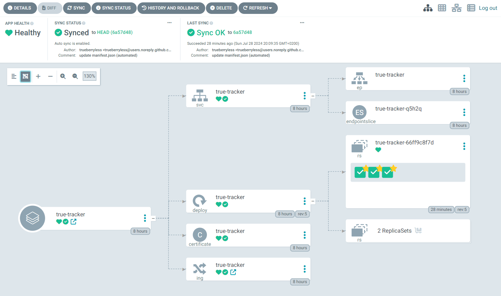

Après avoir lu l'article de Vegard S. Hagen “[Argo CD Kustomize with Helm](https://blog.stonegarden.dev/articles/2023/09/argocd-kustomize-with-helm/)” et décidé que leur solution ne convenait pas à notre cluster, nous avons directement suivi le guide par défaut "[Getting started](https://argo-cd.readthedocs.io/en/stable/getting_started/)" d'Argo CD. Nous allons maintenant partager avec vous les détails de la configuration d'[Argo CD](https://github.com/argoproj) sur [k3s](https://github.com/k3s-io) et [Cilium](https://github.com/cilium), en poursuivant depuis le chapitre “[Setup Certificate Manager with Cloudflare](../../blog/setup-kubernetes-with-cilium-and-cloudflare#setup-certificate-manager-with-cloudflare/)” de notre récent article “[Setting up Kubernetes with Cilium and Cloudflare](../../blog/setup-kubernetes-with-cilium-and-cloudflare/)”. Dans cet article récent, nous avions également configuré [Keel](https://github.com/keel-hq) à la fin, mais cette étape ne sera désormais plus nécessaire, car nous utiliserons Argo CD pour récupérer le dernier code de pointe de chaque dépôt [GitHub](https://github.com/github). Bonne lecture !

:::note
Nous supposons que vous avez suivi [notre autre article de blog](../../blog/setup-kubernetes-with-cilium-and-cloudflare/).
:::

## Prérequis

Avant de commencer, nous devons nous assurer que `kubectl` est installé, que nous disposons d'un fichier kubeconfig (k3s enregistre ce fichier ici :

```yaml
#/etc/rancher/k3s/config.yaml
flannel-backend: "none"
disable-kube-proxy: true
disable-network-policy: true
cluster-init: true
disable:
    - servicelb
    - traefik
```

) et CoreDNS (vérifiez si CoreDNS est installé en exécutant cette

```bash
kubectl get pods -n kube-system -l k8s-app=kube-dns
```

commande).

## Installation

Tout d'abord, appliquons tous les services nécessaires, déploiements et nombreuses autres ressources Kubernetes différentes en exécutant :

```bash
kubectl create namespace argocd
kubectl apply -n argocd -f https://raw.githubusercontent.com/argoproj/argo-cd/stable/manifests/install.yaml
```

## Certificat

De plus, nous aurons besoin d'un certificat :

```yaml
apiVersion: cert-manager.io/v1
kind: Certificate
metadata:
    name: argocd
    namespace: argocd
spec:
    secretName: argocd
    issuerRef:
        name: acme-issuer
        kind: ClusterIssuer
    dnsNames:
        - "argo-cd.trueberryless.org"
```

Appliquez cette ressource en exécutant `kubectl apply -f certificate.yaml`.

## Contrôleur Ingress

Et nous aurons besoin d'un contrôleur d'ingress géré par Cilium :

```yaml
apiVersion: networking.k8s.io/v1
kind: Ingress
metadata:
    name: argocd-ingress
    namespace: argocd
spec:
    rules:
        - host: argo-cd.trueberryless.org
          http:
              paths:
                  - path: /
                    pathType: Prefix
                    backend:
                        service:
                            name: argocd-server
                            port:
                                number: 80

    tls:
        - hosts:
              - argo-cd.trueberryless.org
          secretName: argocd
```

Appliquez cette ressource en exécutant `kubectl apply -f argocd-ingress.yaml`.

## Désactiver TSL dans Argo CD

Avec le certificat, la connexion entre le client et le serveur est sécurisée. Cependant, il y a encore un certificat auto-signé au sein des services [Argo CD](https://github.com/argoproj), dont nous n'avons pas nécessairement besoin. Nous pouvons donc désactiver la sécurité du serveur Argo CD en modifiant la propriété `server.insecure`.

Pour ce faire, nous exécutons d'abord cette commande :

```bash
kubectl edit cm argocd-cmd-params-cm -n argocd
```

ce qui ouvrira, espérons-le, un fichier dans vim ou neovim (sinon, ce serait décevant si vous nous demandez, MDR). Le fichier devrait ressembler à quelque chose comme ceci :

```yaml {21-22}
# Please edit the object below. Lines beginning with a '#' will be ignored,
# and an empty file will abort the edit. If an error occurs while saving this file will be
# reopened with the relevant failures.
#
apiVersion: v1
data:
    server.insecure: "true"
kind: ConfigMap
metadata:
    annotations:
        kubectl.kubernetes.io/last-applied-configuration: |
            {"apiVersion":"v1","kind":"ConfigMap","metadata":{"annotations":{},"labels":{"app.kubernetes.io/name":"argocd-cmd-params-cm","app.kubernetes.io/part-of":"argocd"},"name":"arg
    creationTimestamp: "2024-07-27T11:15:28Z"
    labels:
        app.kubernetes.io/name: argocd-cmd-params-cm
        app.kubernetes.io/part-of: argocd
    name: argocd-cmd-params-cm
    namespace: argocd
    resourceVersion: "239710156"
    uid: 5f53d26b-3adf-4ed9-9807-c3da847335a2
data:
    server.insecure: "true"
```

Les deux dernières lignes ne seront probablement pas présentes au début, mais c'est exactement le paramètre que nous voulons obtenir. Ajoutez ces deux lignes (marquées ci-dessus) et enregistrez le fichier (`Esc` → `:wq` si vous êtes cool).

Redémarrez le serveur Argo CD en exécutant et en attendant que le déploiement soit terminé :

```bash
kubectl rollout restart deploy argocd-server -n argocd
kubectl rollout status deploy argocd-server -n argocd
```

Après toutes ces étapes, nous devrions maintenant voir l'interface utilisateur sous [`https://argo-cd.trueberryless.org`](https://argo-cd.trueberryless.org) (protégée par mot de passe).


:::note
Les identifiants de l'interface utilisateur d'Argo CD consistent en un utilisateur et un mot de passe. L'utilisateur est toujours `admin` et vous pouvez obtenir votre mot de passe en exécutant :

```bash
kubectl -n argocd get secret argocd-initial-admin-secret -o jsonpath="{.data.password}" | base64 -d
```
:::

## Ajouter un manifest au dépôt

Pour créer une nouvelle application dans [Argo CD](https://github.com/argoproj) (soit via l'interface utilisateur soit via la CLI — nous utilisons l'interface utilisateur car nous n'avons pas configuré la CLI), nous devons préparer le dépôt Git. Comme le dépôt est la source unique de vérité, c'est également l'endroit où nous définissons toutes les ressources Kubernetes qui devraient être créées par Argo CD.

Nous recommandons de créer un nouveau dossier dans le dépôt Git appelé quelque chose comme `manifest`. Dans ce dossier, nous allons créer quelques fichiers :

* `certificate.yaml` :

  ```yaml
  apiVersion: cert-manager.io/v1
  kind: Certificate
  metadata:
  name: mutanuq
  namespace: mutanuq
  spec:
  secretName: mutanuq
  issuerRef:
      name: acme-issuer
      kind: ClusterIssuer
  dnsNames:
      - "mutanuq.trueberryless.org"
  ```

* `deployment.yaml` :

  ```yaml
  apiVersion: apps/v1
  kind: Deployment
  metadata:
      name: mutanuq
      namespace: mutanuq
      labels:
          app: mutanuq
  spec:
      replicas: 3
      selector:
          matchLabels:
              app: mutanuq
      template:
          metadata:
              labels:
                  app: mutanuq
          spec:
              containers:
                  - name: mutanuq
                  image: "trueberryless/mutanuq"
                  imagePullPolicy: Always
  ```

* `service.yaml` :

  ```yaml
  apiVersion: v1
  kind: Service
  metadata:
  name: mutanuq
  namespace: mutanuq
  annotations:
      cert-manager.io/issuer: acme-issuer
  spec:
  selector:
      app: mutanuq
  ports:
      - name: http
      port: 80
  ```

* `ingress.yaml` :

  ```yaml
  apiVersion: networking.k8s.io/v1
  kind: Ingress
  metadata:
  name: mutanuq
  namespace: mutanuq
  spec:
  rules:
      - host: mutanuq.trueberryless.org
      http:
          paths:
          - path: /
              pathType: Prefix
              backend:
              service:
                  name: mutanuq
                  port:
                  number: 80

  tls:
  - hosts:
      - mutanuq.trueberryless.org
      secretName: mutanuq
  ```

Ces fichiers sont en gros les mêmes que ceux mentionnés dans [l'autre article](../../blog/setup-kubernetes-with-cilium-and-cloudflare#example-app-mutanuq/) mais séparés en quatre fichiers, car cela nous donne l'avantage de manipuler le manifeste depuis [GitHub](https://github.com/github) Actions. Mais commençons par les bases, vous verrez dans [le prochain article](../../blog/setup-continuous-integration-github-repository/) comment configurer le manifeste avec les actions GitHub.

## Créer une nouvelle application dans l'interface utilisateur d'Argo CD

Vous verrez probablement le grand bouton `NEW APP` dans l'interface utilisateur de [Argo CD](https://github.com/argoproj). Cliquez dessus et créez une nouvelle application avec les propriétés adaptées ci-dessous :

* Nom de l'application : `mutanuq`
* Nom du projet : `default`
* Politique de synchronisation : Découvrez-en plus dans [cet article](../../blog/setup-continuous-integration-github-repository/) / laissez sur `Manual` pour l'instant
* URL du dépôt : `https://github.com/trueberryless-org/mutanuq`
* Révision : `HEAD`
* Chemin : `manifest`
* URL du cluster : `https://kubernetes.default.svc`
* Espace de noms : `mutanuq`

Facultativement — si vous avez [la CLI installée](https://argo-cd.readthedocs.io/en/stable/cli_installation/) — vous pouvez exécuter cette commande pour obtenir le même résultat :

```bash
argocd app create mutanuq \
  --project default \
  --repo https://github.com/trueberryless-org/mutanuq \
  --revision HEAD \
  --path manifest \
  --dest-server https://kubernetes.default.svc \
  --dest-namespace mutanuq
```

Vous devriez maintenant pouvoir voir votre site web en cours de déploiement dans l'interface utilisateur. Ce processus peut prendre un certain temps, par exemple parce que la demande de certificat doit être approuvée. Une application en bonne santé devrait ressembler à ceci :



## Célébrez avec un café !

Félicitations, vous avez réussi à configurer [Argo CD](https://github.com/argoproj) sur un cluster [k3s](https://github.com/k3s-io) ! Vous méritez une pause café. Savourez une tasse bien méritée, et si vous voulez partager un café virtuel avec moi, n'hésitez pas à soutenir mon travail sur [Ko-fi](https://ko-fi.com/trueberryless). Merci !

## Continuer

À suivre dans notre [prochain article de blog](../../blog/setup-continuous-integration-github-repository/) qui décrira comment configurer un dépôt [GitHub](https://github.com/github) qui pourra ensuite être déployé via Argo CD.
